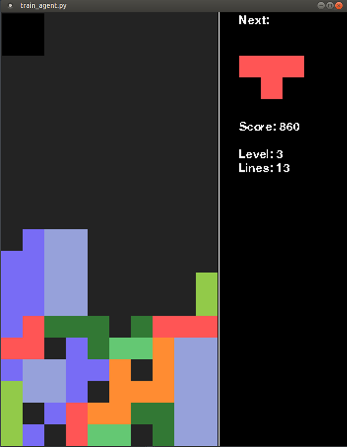

# Tetris AI using TAMER
Training AI agents to play tetris using a human-guided machine learning (HGML) technique called TAMER (Teaching Agents Manually through Evaluative Reinforcement)

<center></center>

## Installation


**NOTE**: tested on Ubuntu 18 and Python 3.7

### Setup dependencies (Linux)

All dependencies will be contained in a virtual environment.

Install _pip_ and _virtualenv_ to handle all Python3 dependencies:  
```sudo apt-get install python3-pip```  
```python3 -m pip install --user virtualenv```  


Create a new virtual environment:  
```python3 -m venv ~/venvs/TetrisAI```

Clone this repo and go to its folder:  
```git clone https://github.com/nwayt001/TetrisAI.git```  
```cd TetrisAI```  


Activate the new environment and install dependencies:  
```source ~/venvs/TetrisAI/bin/activate```  
```pip install -r requirements.txt```

## Training TAMER agent to play tetris

``python3 train_agent.py```

use up and down arrows on keyboard to provide positive and negative feedback for each tetris move.
